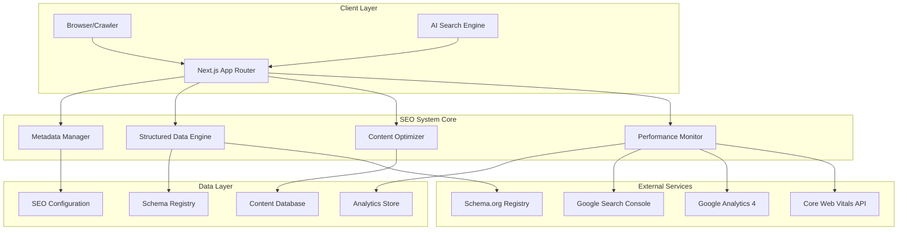

# Design Document: SEO and AI Search Optimization System

## Overview

This design document outlines a comprehensive SEO and AI search optimization system for Dustin J. Ober's portfolio website. The system leverages Next.js 14+ capabilities to implement advanced metadata management, structured data markup, performance optimization, and AI-friendly content structuring. The architecture prioritizes both traditional search engine optimization and emerging AI search platforms including Google SGE, ChatGPT Search, Perplexity, and Bing Copilot.

The system follows modern Answer Engine Optimization (AEO) and Generative Engine Optimization (GEO) principles, ensuring content is optimized for both traditional crawlers and AI language models that synthesize and cite information.

## Architecture

### High-Level Architecture



### Component Architecture

The system consists of four primary components:

1. **Metadata Manager**: Handles dynamic metadata generation, Open Graph optimization, and canonical URL management
2. **Structured Data Engine**: Manages JSON-LD schema markup generation and validation
3. **Content Optimizer**: Processes content for AI readability and search optimization
4. **Performance Monitor**: Tracks Core Web Vitals and implements optimization strategies

## Components and Interfaces

### Metadata Manager

**Purpose**: Centralized management of all page metadata including titles, descriptions, Open Graph tags, and Twitter Cards.

**Key Features**:
- Dynamic metadata generation based on page content
- Template-based title and description creation
- Automatic canonical URL generation
- Social media optimization
- International SEO support

**Interface**:
```typescript
interface MetadataManager {
  generatePageMetadata(pageType: PageType, content: PageContent): Metadata;
  generateOpenGraphData(content: PageContent): OpenGraphData;
  generateTwitterCardData(content: PageContent): TwitterCardData;
  validateMetadata(metadata: Metadata): ValidationResult;
}

interface PageContent {
  title: string;
  description: string;
  keywords: string[];
  author?: string;
  publishDate?: Date;
  modifiedDate?: Date;
  images?: ImageData[];
  type: 'homepage' | 'about' | 'project' | 'article' | 'contact';
}
```

### Structured Data Engine

**Purpose**: Generates and manages JSON-LD structured data markup for enhanced search engine understanding.

**Key Features**:
- Person schema for professional profile
- CreativeWork/SoftwareApplication schemas for projects
- Article schema for blog content
- Organization schema for affiliations
- Educational schemas for certifications and courses

**Interface**:
```typescript
interface StructuredDataEngine {
  generatePersonSchema(profile: ProfessionalProfile): PersonSchema;
  generateProjectSchema(project: ProjectData): CreativeWorkSchema;
  generateArticleSchema(article: ArticleData): ArticleSchema;
  generateOrganizationSchema(org: OrganizationData): OrganizationSchema;
  validateSchema(schema: JSONLDSchema): ValidationResult;
}

interface ProfessionalProfile {
  name: string;
  jobTitle: string;
  description: string;
  skills: string[];
  experience: ExperienceItem[];
  education: EducationItem[];
  certifications: CertificationItem[];
  contactInfo: ContactInfo;
}
```

### Content Optimizer

**Purpose**: Optimizes content structure and presentation for both traditional SEO and AI search engines.

**Key Features**:
- Heading hierarchy optimization
- Keyword density analysis
- AI-friendly content structuring
- FAQ generation and markup
- Content freshness tracking

**Interface**:
```typescript
interface ContentOptimizer {
  optimizeHeadingStructure(content: string): OptimizedContent;
  generateFAQSchema(questions: FAQItem[]): FAQSchema;
  analyzeKeywordDensity(content: string, keywords: string[]): KeywordAnalysis;
  structureForAI(content: string): AIOptimizedContent;
  generateContentSummary(content: string): ContentSummary;
}

interface AIOptimizedContent {
  summary: string;
  keyPoints: string[];
  structuredSections: ContentSection[];
  citableQuotes: string[];
  relatedTopics: string[];
}
```

### Performance Monitor

**Purpose**: Tracks and optimizes Core Web Vitals and overall site performance.

**Key Features**:
- Real-time Core Web Vitals monitoring
- Image optimization and lazy loading
- Code splitting and bundle optimization
- Caching strategy implementation
- Performance reporting and alerts

**Interface**:
```typescript
interface PerformanceMonitor {
  measureCoreWebVitals(): CoreWebVitalsMetrics;
  optimizeImages(images: ImageData[]): OptimizedImageData[];
  implementLazyLoading(elements: HTMLElement[]): void;
  generatePerformanceReport(): PerformanceReport;
  trackUserExperience(metrics: UXMetrics): void;
}

interface CoreWebVitalsMetrics {
  lcp: number; // Largest Contentful Paint
  inp: number; // Interaction to Next Paint (replaced FID in 2024)
  cls: number; // Cumulative Layout Shift
  ttfb: number; // Time to First Byte
  fcp: number; // First Contentful Paint
}
```

## Data Models

### SEO Configuration Model

```typescript
interface SEOConfig {
  site: {
    name: string;
    url: string;
    description: string;
    author: string;
    language: string;
    locale: string;
  };
  
  metadata: {
    titleTemplate: string;
    defaultTitle: string;
    defaultDescription: string;
    keywords: string[];
    robots: RobotsConfig;
  };
  
  socialMedia: {
    twitter: string;
    linkedin: string;
    github: string;
  };
  
  analytics: {
    googleAnalyticsId: string;
    googleSearchConsoleId: string;
    enableCoreWebVitals: boolean;
  };
}
```

### Schema Registry Model

```typescript
interface SchemaRegistry {
  person: PersonSchemaTemplate;
  organization: OrganizationSchemaTemplate;
  creativeWork: CreativeWorkSchemaTemplate;
  article: ArticleSchemaTemplate;
  faq: FAQSchemaTemplate;
  breadcrumb: BreadcrumbSchemaTemplate;
}

interface PersonSchemaTemplate {
  "@context": "https://schema.org";
  "@type": "Person";
  name: string;
  jobTitle: string;
  description: string;
  url: string;
  sameAs: string[];
  knowsAbout: string[];
  alumniOf: EducationalOrganization[];
  hasCredential: EducationalOccupationalCredential[];
}
```

### Content Analytics Model

```typescript
interface ContentAnalytics {
  pageViews: number;
  organicTraffic: number;
  searchQueries: SearchQuery[];
  coreWebVitals: CoreWebVitalsMetrics;
  userEngagement: EngagementMetrics;
  aiCitations: AICitationData[];
}

interface AICitationData {
  platform: 'ChatGPT' | 'Perplexity' | 'Google SGE' | 'Bing Copilot';
  citationCount: number;
  queries: string[];
  lastCited: Date;
}
```

## Correctness Properties

*A property is a characteristic or behavior that should hold true across all valid executions of a system—essentially, a formal statement about what the system should do. Properties serve as the bridge between human-readable specifications and machine-verifiable correctness guarantees.*

Now I'll analyze the acceptance criteria to determine which ones can be tested as properties:

### Property Reflection

After analyzing all acceptance criteria, I identified several properties that can be consolidated for better test coverage and reduced redundancy:

- **Metadata properties** can be combined to test comprehensive metadata validation across all page types
- **Schema properties** can be grouped by content type (Person, Organization, Creative Work) for more efficient testing
- **Performance properties** should remain separate as they test distinct Core Web Vitals metrics
- **Content optimization properties** can be consolidated into comprehensive content structure validation
- **Security properties** can be combined into a single security compliance validation

### Correctness Properties

Property 1: **Comprehensive Metadata Validation**
*For any* page content and page type, the generated metadata should include complete title tags under 60 characters, unique meta descriptions under 160 characters, proper Open Graph data, and canonical URLs
**Validates: Requirements 1.1, 1.2, 1.3, 1.4**

Property 2: **Schema Markup Completeness by Content Type**
*For any* content type (Person, Project, Article, Organization), the generated JSON-LD schema should include all required fields according to Schema.org specifications and pass validation
**Validates: Requirements 2.1, 2.2, 2.3, 2.4, 2.5, 2.6**

Property 3: **Content Structure Optimization**
*For any* page content, the optimized output should maintain proper heading hierarchy (H1-H6), include target keywords naturally, and structure information in machine-readable formats
**Validates: Requirements 3.1, 3.2, 3.3, 3.4, 3.5**

Property 4: **Technical SEO Infrastructure**
*For any* site configuration, the generated technical SEO elements should include valid XML sitemaps, proper robots.txt directives, descriptive internal link anchor text, and breadcrumb navigation with schema markup
**Validates: Requirements 4.1, 4.3, 4.4, 4.6**

Property 5: **Core Web Vitals Performance Standards**
*For any* page load scenario, the measured Largest Contentful Paint should be under 2.5 seconds, Interaction to Next Paint under 200 milliseconds, and Cumulative Layout Shift under 0.1
**Validates: Requirements 5.1, 5.2, 5.3**

Property 6: **Performance Optimization Implementation**
*For any* page with images and resources, the system should implement lazy loading attributes, efficient caching headers, and multiple image format options (WebP, AVIF)
**Validates: Requirements 5.4, 5.5, 11.3, 11.5**

Property 7: **AI-Optimized Content Structure**
*For any* professional content, the optimized output should include question-answer formats, extractable key information, conversational patterns, and verifiable credentials
**Validates: Requirements 9.1, 9.2, 9.3, 9.4, 9.5**

Property 8: **Mobile-First Optimization**
*For any* page accessed on mobile devices, the system should ensure responsive design with optimal touch targets, mobile-first indexing optimization, and fast tap response times
**Validates: Requirements 10.1, 10.2, 10.5**

Property 9: **Accessibility and International Compliance**
*For any* page content, the system should include proper ARIA labels, semantic HTML structure, WCAG-compliant color contrast, and keyboard accessibility for all interactive elements
**Validates: Requirements 13.2, 13.3, 13.4, 13.5**

Property 10: **E-A-T Signal Implementation**
*For any* professional profile content, the system should prominently display certifications, include links to published work, show contact information, and feature client testimonials with verifiable outcomes
**Validates: Requirements 14.1, 14.2, 14.3, 14.5**

Property 11: **Voice Search and Featured Snippet Optimization**
*For any* content targeting voice search, the system should structure information in Q&A formats, provide concise definitive answers, include long-tail keyword variations, and implement FAQ schema markup
**Validates: Requirements 15.1, 15.2, 15.3, 15.4**

Property 12: **Security and Trust Signal Validation**
*For any* site access, the system should enforce HTTPS with valid SSL certificates, implement proper Content Security Policy headers, include security tokens in forms, and display privacy policy links prominently
**Validates: Requirements 17.1, 17.2, 17.3, 17.4**

Property 13: **Analytics and Performance Tracking**
*For any* user interaction, the system should track enhanced ecommerce events, monitor Core Web Vitals continuously, segment organic traffic by source, and connect traffic to business outcomes
**Validates: Requirements 8.3, 8.5, 18.1, 18.5**

Property 14: **Content Freshness and Update Automation**
*For any* content update, the system should implement proper last-modified headers, automatically update sitemaps with change frequencies, and add completion dates to finished projects
**Validates: Requirements 12.1, 12.2, 12.3**

Property 15: **Rich Media SEO Enhancement**
*For any* media content (images, videos), the system should include descriptive filenames with keywords, implement proper schema markup, generate image sitemaps, and provide accessibility features
**Validates: Requirements 11.1, 11.2, 11.4, 11.5**

## Error Handling

### Validation Error Handling

The system implements comprehensive error handling for SEO validation failures:

**Schema Validation Errors**:
- Invalid JSON-LD structure detection and reporting
- Missing required schema fields identification
- Schema.org compliance validation with detailed error messages
- Automatic fallback to basic schema when complex validation fails

**Performance Error Handling**:
- Core Web Vitals threshold breach alerts and automatic optimization
- Image optimization failure fallbacks to standard formats
- Lazy loading implementation errors with graceful degradation
- CDN failure detection with local resource serving

**Content Optimization Errors**:
- Heading hierarchy validation with automatic correction suggestions
- Keyword density analysis with over-optimization warnings
- Content length validation with recommendations for improvement
- AI content structure validation with formatting suggestions

### Monitoring and Alerting

**Real-time Monitoring**:
- Continuous Core Web Vitals tracking with threshold alerts
- Schema validation monitoring with immediate error notifications
- Search Console integration for crawl error detection
- Analytics anomaly detection for traffic and engagement drops

**Error Recovery Strategies**:
- Automatic retry mechanisms for failed API calls to external services
- Graceful degradation when third-party services are unavailable
- Cached fallback content serving during system maintenance
- Progressive enhancement ensuring basic functionality always works

## Testing Strategy

### Dual Testing Approach

The SEO optimization system requires both unit testing and property-based testing to ensure comprehensive coverage:

**Unit Tests** focus on:
- Specific metadata generation examples for different page types
- Schema markup validation for known content structures
- Performance optimization implementation verification
- Error handling scenarios with known failure cases
- Integration points with external services (Google Analytics, Search Console)

**Property-Based Tests** focus on:
- Universal properties that hold across all content types and configurations
- Comprehensive input coverage through randomized content generation
- Cross-browser and device compatibility validation
- Performance characteristics across varying content sizes and complexity
- Schema validation across all possible content combinations

### Property-Based Testing Configuration

**Testing Framework**: Fast-check for TypeScript/JavaScript property-based testing
**Test Configuration**: Minimum 100 iterations per property test to ensure statistical significance
**Test Tagging**: Each property test references its design document property using the format:
`**Feature: seo-ai-optimization, Property {number}: {property_text}**`

**Generator Strategies**:
- **Content Generators**: Create realistic professional content with varying lengths, structures, and keyword densities
- **Schema Generators**: Generate valid and invalid schema structures to test validation robustness
- **Performance Generators**: Create content scenarios with different image sizes, script loads, and complexity levels
- **Device Generators**: Simulate various mobile devices, screen sizes, and network conditions

### Integration Testing Strategy

**Search Engine Integration**:
- Google Search Console API integration testing with mock and live environments
- Schema validation using Google's Structured Data Testing Tool
- Core Web Vitals measurement using Google PageSpeed Insights API
- Analytics integration testing with Google Analytics 4

**Cross-Platform Validation**:
- Multi-browser testing for metadata and schema rendering
- Mobile device testing across iOS and Android platforms
- Screen reader compatibility testing for accessibility compliance
- Voice search optimization testing with various AI assistants

### Performance Testing Requirements

**Load Testing**:
- Page load performance under various traffic conditions
- Image optimization effectiveness across different file sizes and formats
- CDN performance validation with geographic distribution testing
- Database query optimization for dynamic content generation

**Monitoring Integration**:
- Real User Monitoring (RUM) data collection and analysis
- Synthetic monitoring for continuous performance validation
- Core Web Vitals tracking with historical trend analysis
- Competitive benchmarking against industry standards

The testing strategy ensures that all SEO optimizations maintain effectiveness across diverse content types, user scenarios, and technical environments while providing measurable improvements in search visibility and user experience.