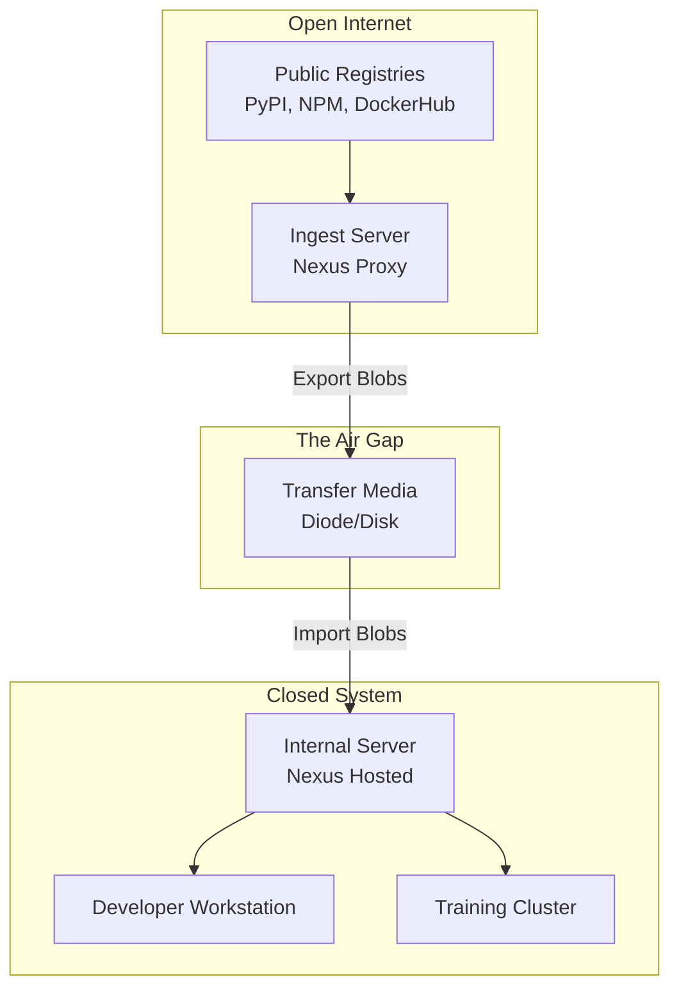

# **Whitepaper #02: The Disconnected Pipeline**

**Subtitle:** *Solving Dependency Management & Containerization in Secure Facilities*
**Author:** Dustin J. Ober, PMP
**Date:** January 2025
**Version:** 2.0 (Expanded)

---

## **1. Executive Summary**

**The Bottom Line Up Front (BLUF):**
The single greatest bottleneck in sovereign AI development is not compute power, but **dependency management**. Modern software engineering relies on a "connected supply chain" (PyPI, npm, Docker Hub, Hugging Face). When this chain is broken by an air-gap or secure boundary, development velocity typically drops by **80-90%**, transforming simple integration tasks into multi-week engineering efforts.

**The Solution:**
This whitepaper outlines a standardized **"Disconnected DevOps"** pipeline. It moves organizations away from ad-hoc file transfers ("burning a DVD with zip files") to a structured, automated system of **Internal Mirrors**, **Containerized Artifacts**, and **Cryptographic Governance**.

**The Outcome:**
By implementing local package repositories (e.g., Sonatype Nexus, Harbor) and utilizing standardized container transport (Docker/Apptainer), organizations can restore the "connected" developer experience while maintaining **100% Zero Trust compliance**. This architecture enables:
1.  **Velocity:** Reduced library ingestion time from weeks to minutes.
2.  **Security:** Full Software Bill of Materials (SBOM) visibility before bytes cross the wire.
3.  **Consistency:** Bit-for-bit identical environments between unclassified development and classified production.

---

## **2. Strategic Context: The "Connected Assumption"**

Modern software development operates under a pervasive, silent assumption: **The Internet is always there.**

When a data scientist runs `pip install torch` or a developer types `npm install react`, they are interacting with a complex, distributed global supply chain. A single command triggers hundreds of HTTP requests to fetch metadata, resolve version constraints, and download binaries from content delivery networks (CDNs) around the world.

### **2.1 The Cost of Disconnection**

In Sovereign AI environments—such as secure government facilities, critical infrastructure control planes, or intellectual property (IP) vaults—this "Connected Assumption" is invalid. The consequences are immediate and severe:

*   **Productivity Collapse:** A task that takes 30 seconds in a commercial startup (e.g., getting a new library) can take 3-4 weeks in a classified environment due to manual review and transfer processes.
*   **Shadow IT & Drift:** Frustrated developers often resort to "sneakernet" workarounds, bringing in unauthorized USB drives or hand-editing code to bypass dependencies. This leads to configuration drift, where code works on one secure terminal but fails on another.
*   **Security Paradox:** Paradoxically, disconnected systems often run *older*, *more vulnerable* software because the friction of patching is too high. A connected system patches `openssl` in minutes; a disconnected system might run a vulnerable version for months waiting for the next scheduled update cycle.

### **2.2 The Sovereign Imperative**

For a nation or enterprise to maintain AI sovereignty, it cannot rely on live connections to repositories controlled by foreign entities or public corporations. Sovereignty requires **supply chain ownership**.

You must possess not just the model weights, but the entire dependency tree required to train, fine-tune, and run those models. This whitepaper provides the architectural blueprint to own that supply chain without sacrificing the agility required for modern AI development.

---

## **3. The Operational Challenge: Developing in the Dark**

To understand the solution, we must first quantify the problem. The complexity of modern AI stacks makes manual management impossible.

### **3.1 The "Dependency Hell" Cascade**

A common misconception is that "offline" simply means downloading a few files. In reality, modern libraries are deeply nested trees.

**Case Study: The PyTorch Stack**
A developer requests permission to bring `torch`, `transformers`, and `langchain` into the high side. Security reviews these three names and approves them.
*   **Reality:** `transformers` depends on `huggingface-hub`, `filelock`, `numpy`, `packaging`, `pyyaml`, `regex`, `requests`, `tokenizers`, and `tqdm`.
*   **The Cascade:** `requests` depends on `certifi`, `charset-normalizer`, `idna`, and `urllib3`.
*   **The Result:** A standard AI environment has over **300 transitive dependencies**.

Manually downloading 300 files, checking their hashes, and moving them is a recipe for human error. If even one minor version mismatch occurs (e.g., `numpy` 1.23 vs 1.24), the entire stack may crash with cryptic C++ / CUDA errors.

### **3.2 The "It Works on My Machine" Crisis**

Without a centralized source of truth (like PyPI), every developer's workstation becomes a unique snowflake.
*   **Developer A** brings in `pandas v1.5` on Monday.
*   **Developer B** brings in `pandas v2.0` on Tuesday.
*   **Result:** They cannot collaborate. Scripts written by A fail on B's machine. The team spends more time debugging environment differences than writing model code.

---

## **4. Dependency Ecosystem Deep-Dive**

Successfully disconnected pipelines require mastering the specific quirks of each ecosystem.

### **4.1 Python (The AI Standard)**
*   **Tooling:** `pip`, `conda`, `poetry`.
*   **Challenge:** Python packages come in two forms: *Source Distributions* (`.tar.gz`) which require compiling (often needing `gcc` and headers), and *Wheels* (`.whl`) which are pre-compiled binaries.
*   **Constraint:** Wheels are platform-specific. If your internet-connected ingest station is Windows but your secure server is Linux, `pip download` might fetch Windows DLLs that are useless inside. You must explicitly specify platform tags (e.g., `manylinux2014_x86_64`) when fetching.

### **4.2 JavaScript / TypeScript (The UI Layer)**
*   **Tooling:** `npm`, `yarn`, `pnpm`.
*   **Challenge:** `node_modules` folders are notoriously massive, often containing tens of thousands of small files. Scanning 50,000 tiny Javascript files for viruses takes hours.
*   **Strategy:** Never move `node_modules` folders. Move the compressed "tarball" (`.tgz`) from the registry and install it offline.

### **4.3 The Container Layer (The OS)**
*   **Tooling:** Docker (OCI), Apptainer (SIF).
*   **Challenge:** Base images (like `ubuntu:22.04` or `nvidia/cuda:12.1`) rely on OS package managers (`apt`, `yum`). `apt-get install` fails instantly offline.
*   **Strategy:** You must not only mirror Python libraries but also maintain a mirror of the OS repositories (e.g., an Ubuntu `apt` mirror) or bake everything into the container before it crosses the gap.

### **4.4 The Model Layer (The Weights)**
*   **Tooling:** Hugging Face, PyTorch Hub.
*   **Challenge:** Libraries like `transformers` are designed to "phone home" to fetch models dynamically.
*   **Strategy:** Code must be refactored to load from local paths, or environment variables (`HF_DATASETS_OFFLINE=1`) must be used to force offline mode, pointing to pre-downloaded, cached model weights.

---

## **5. The "Sneakernet" Protocol: Moving Assets Securely**

The "Sneakernet"—physically moving data on portable media—is often ridiculed, but in closed systems, it is the only bandwidth available. The goal is to make it **robust**, automated, and secure.

### **5.1 The "Open Internet" Staging Area**

You must establish a dedicated "Ingest Workstation" connected to the Open Internet. This machine does **not** contain sensitive internal data. Its only purpose is to fetch, build, and bundle public assets.

**The "Bundle" Strategy:**
Never move raw code. Move **Artifacts**.
*   *Bad:* Moving a folder of `.py` scripts.
*   *Good:* Moving a Docker Image (`.tar`) or a Python Wheel (`.whl`).

### **5.2 The Docker "Save/Load" Workflow**

Containerization is the ultimate transport wrapper. It freezes the OS, drivers, and libraries into a single file.

**Step 1: Build on the Open Internet**
```bash
# On the Internet-connected machine
docker build -t my-ai-app:v1 .
```

**Step 2: Export to Artifact**
Docker provides a native command to flatten an image into a tarball.
```bash
docker save -o my-ai-app_v1.tar my-ai-app:v1
```

**Step 3: Transfer & Scan**
Move the `.tar` file to the transfer medium (CD/DVD/Diode). The security team scans *only this one file*. This is significantly faster than scanning thousands of loose source files.

**Step 4: Hydrate in the Closed System**
```bash
# On the Closed System machine
docker load -i my-ai-app_v1.tar
```
*Result:* The exact environment is restored, bit-for-bit.

### **5.3 Automated Ingest Script: The "Bundle Builder"**

Manual `docker save` commands are prone to error. Below is a Python equivalent of a production-grade "Bundler" script that standardizes the artifact creation process.

```python
# artifact_bundler.py
import subprocess
import hashlib
import json
import datetime
from pathlib import Path

def save_image(image_tag, output_dir):
    """Saves docker image and generates SHA256 checksum"""
    clean_name = image_tag.replace(":", "_").replace("/", "_")
    tar_path = output_dir / f"{clean_name}.tar"
    
    print(f"[*] Saving {image_tag} to {tar_path}...")
    subprocess.run(f"docker save -o {tar_path} {image_tag}", shell=True, check=True)
    
    # Calculate Hash
    sha256_hash = hashlib.sha256()
    with open(tar_path, "rb") as f:
        for byte_block in iter(lambda: f.read(4096), b""):
            sha256_hash.update(byte_block)
            
    return tar_path.name, sha256_hash.hexdigest()

def generate_manifest(artifacts, output_dir):
    """Creates a relentless audit trail"""
    manifest = {
        "timestamp": datetime.datetime.now().isoformat(),
        "origin_user": subprocess.getoutput("whoami"),
        "artifacts": artifacts
    }
    
    with open(output_dir / "transfer_manifest.json", "w") as f:
        json.dump(manifest, f, indent=2)
    print(f"[*] Manifest generated at {output_dir}/transfer_manifest.json")

if __name__ == "__main__":
    TARGET_IMAGES = ["pytorch/pytorch:2.1.0-cuda12.1-cudnn8-runtime", "nginx:alpine"]
    OUT_DIR = Path("./transfer_bundle")
    OUT_DIR.mkdir(exist_ok=True)
    
    artifact_list = []
    for img in TARGET_IMAGES:
        subprocess.run(f"docker pull {img}", shell=True)
        fname, fhash = save_image(img, OUT_DIR)
        artifact_list.append({"file": fname, "sha256": fhash, "source": img})
        
    generate_manifest(artifact_list, OUT_DIR)
```


---

## **6. Mirroring the World: The Local Repository Strategy**

While "Sneakernet" works for massive artifacts (like whole applications), it is inefficient for granular dependency management. You cannot burn a DVD every time a developer needs a tiny helper library like `tqdm`.

The solution is to establish a **Local Mirror**—an internal server that mimics the directory structure of public repositories.

### **6.1 The Infrastructure: Nexus or Artifactory**

You need a "Binary Repository Manager." The two industry standards are **Sonatype Nexus** and **JFrog Artifactory**.

**The Architecture:**


### **6.3 Mirror Architecture Patterns**

**Pattern A: The "Shop Vac" (Small Teams)**
For small teams, you don't need a full server sync. Use a script to download specific approved packages and sneaker-net them to a simple file server.
*   *Pros:* Simple, low maintenance.
*   *Cons:* Developers constantly ask "can you get library X?" which creates bottlenecks.

**Pattern B: The "Periodic Snapshot" (Medium Teams)**
The Ingest Server mirrors the *entire* relevant slice of PyPI (e.g., all packages updated in the last month). This blob is transferred weekly.
*   *Pros:* Developers rarely have to ask for updates; they are likely already there.
*   *Cons:* High storage requirements (Terabytes).

**Pattern C: The "Diode Stream" (Enterprise / Critical)**
An automated rigid pipe (Data Diode) pushes updates one-way continuously.
*   *Pros:* Near real-time parity with the outside world.
*   *Cons:* Expensive hardware, complex configuration.

### **6.4 Nexus Configuration Deep Dive**

Configuring Nexus for a disconnected environment is non-trivial. You must explicitly disable outbound connection attempts on the secure side to prevent timeouts.

**Key Configuration: Blocking Outbound Traffic**
In `nexus.properties`, ensure the following flags are set to prevent the server from hanging while trying to reach `sonatype.org` for updates:

```properties
# nexus.properties
nexus.scripts.allowCreation=true
nexus.security.randompassword=false
system.org.sonatype.nexus.proxy.maven.routing.Config.count=1
http.nonProxyHosts=localhost|127.0.0.1
```

**Blob Store Sizing Guide**
When planning storage for your mirror, use these 2024 baselines:

| Repository | Scope | Estimated Size (1 Year) |
|------------|-------|-------------------------|
| **PyPI** | All Packages | ~12 TB |
| **PyPI** | "Data Science Slice" (PyTorch, TF, etc.) | ~1.5 TB |
| **NPM** | All Packages | ~25 TB |
| **DockerHub** | Top 1000 Official Images | ~8 TB |
| **Hugging Face** | Top 10 LLMs (Weights + history) | ~3 TB |


### **6.3 Configuring the Client (Transparency)**

The goal is **Transparency**. The developer should type `pip install` and have it work, without knowing the internet is gone.

**For Python (pip):**
Modify `~/.pip/pip.conf` (Linux) or `%APPDATA%\pip\pip.ini`:
```ini
[global]
index-url = https://nexus.internal.lab/repository/pypi-hosted/simple
trusted-host = nexus.internal.lab
```

**For Hugging Face (Local):**
Point libraries to your local cache or offline endpoint:
```bash
# In .bashrc
export HF_DATASETS_OFFLINE=1
export TRANSFORMERS_OFFLINE=1
export HF_HOME=/mnt/shared/models/huggingface
```

---

## **7. Advanced Containerization: Apptainer (Singularity)**

While Docker is the standard for *building* containers, it is often forbidden in Closed Systems (especially High-Performance Computing (HPC) clusters) because the Docker daemon requires `root` privileges. If a container breaks out, the attacker gains root access to the host node—a risk unacceptable in Top Secret environments.

**The Solution:** **Apptainer** (formerly Singularity).

### **7.1 The SIF Standard**
Apptainer compresses an entire container into a Single Image File (`.sif`). Unlike Docker layers, a `.sif` file is a single, immutable artifact that can be cryptographically signed.

| Feature | Docker | Apptainer |
|---------|--------|-----------|
| **Format** | Layered tarball | Single `.sif` file |
| **Privileges** | Requires `root` daemon | Rootless execution |
| **Signing** | Docker Content Trust | Native GPG signing |
| **HPC Support** | Limited | Native (MPI, SLURM) |
| **GPU Passthrough** | `--gpus` flag | `--nv` flag (simpler) |

### **7.2 The "Docker-to-Apptainer" Pipeline**
You do not need to rewrite your Dockerfiles. You simply convert them at the boundary.

**Step 1: Save Docker Image (Open Internet)**
```bash
docker save -o my-model.tar my-model:latest
```

**Step 2: Build SIF (Transfer Boundary)**
Use Apptainer to convert the Docker tarball into a secure SIF image.
```bash
apptainer build my-model.sif docker-archive://my-model.tar
```

**Step 3: Execute Securely (Closed System)**
Run the image as a standard user (no root required).
```bash
apptainer run --nv my-model.sif
```
*Note:* The `--nv` flag passes the NVIDIA GPU drivers from the host into the container automatically—a massive quality-of-life feature for AI workloads.

### **7.3 Multi-Node Scaling**
In large sovereign clusters, you will run distributed training across multiple nodes. Apptainer integrates natively with SLURM schedulers.
```bash
# Example SLURM script
srun --mpi=pmi2 apptainer exec --nv my-model.sif python train.py
```

---

## **8. Container Registry Operations**

Managing containers at scale requires more than just a folder of files. You need an **Internal Container Registry**.

### **8.1 Choosing a Registry**
*   **Harbor:** The strongest open-source contender. It includes built-in vulnerability scanning (Trivy), image signing (Notary), and role-based access control (RBAC). It is CNCF graduated and highly recommended for sovereign clouds.
*   **Nexus / Artifactory:** If you are already using these for Python mirrors, they can also serve as Docker registries.

### **8.2 Storage Management**
A single AI model container can be 10GB-20GB. Storage fills up fast.
*   **Retention Policy:** Configure your registry to auto-delete images untagged for >90 days.
*   **Garbage Collection:** Schedule weekly "Garbage Collection" jobs to physically free up disk space from deleted layers.

---

## **9. Security & Governance: The "Golden Image"**

In a Closed System, you cannot "patch" vulnerabilities easily. Therefore, security shifts left—it must happen *before* the artifact enters the air-gap.

### **9.1 The Software Bill of Materials (SBOM)**
Every container entering the Closed System must accompany an SBOM. This is a manifest listing every library (OS-level and Python-level) inside the image.

*   **Tooling:** Use **Syft** or **Grype** to generate SBOMs during the build process.
    ```bash
    syft my-model:latest -o cyclonedx-json > sbom.json
    ```
*   **The Audit:** If a new CVE is discovered in `OpenSSL`, you query your central SBOM database to find exactly which offline containers are affected, rather than scanning terabytes of closed-system drives.

**Example CycloneDX SBOM (JSON)**
A valid SBOM reveals the hidden tree. Notice how deep the dependency chain goes:

```json
{
  "bomFormat": "CycloneDX",
  "specVersion": "1.4",
  "version": 1,
  "components": [
    {
      "type": "library",
      "name": "openssl",
      "version": "3.0.2-0ubuntu1.10",
      "purl": "pkg:deb/ubuntu/openssl@3.0.2-0ubuntu1.10?arch=amd64",
      "properties": [
        { "name": "syft:location:0:path", "value": "/usr/bin/openssl" }
      ]
    },
    {
      "type": "library",
      "name": "torch",
      "version": "2.1.0",
      "purl": "pkg:pypi/torch@2.1.0",
      "licenses": [ { "license": { "id": "BSD-3-Clause" } } ]
    }
  ]
}
```
*Security Insight:* By indexing these JSON files into a simple search engine (like Elasticsearch), a Security Officer can type `openssl < 3.0.5` and instantly identify every container in the facility that needs patching.


### **9.2 The "Golden Image" Strategy**
Do not allow developers to bring in raw base images (like `ubuntu:latest`).

1.  **Create a Base:** Security creates a "Hardened AI Base" (Ubuntu + CUDA + Python + Certs).
2.  **Publish:** This image is available on the Closed System Nexus.
3.  **Mandate:** All developer Dockerfiles must start with:
    `FROM nexus.internal.lab/hardened-ai-base:v1`

**Example Hardened Base Dockerfile:**
```dockerfile
# hardened-ai-base:v1
FROM ubuntu:22.04

# Security hardening
RUN apt-get update && apt-get install -y --no-install-recommends \
    ca-certificates curl \
    && rm -rf /var/lib/apt/lists/*

# CUDA runtime (pre-approved version)
COPY cuda-12.1-runtime.deb /tmp/
RUN dpkg -i /tmp/cuda-12.1-runtime.deb && rm /tmp/*.deb

# Python (pinned version)
RUN apt-get update && apt-get install -y python3.11 \
    && rm -rf /var/lib/apt/lists/*
```

---

## **10. Implementation Case Studies**

### **Case Study A: The "Data Diode" Defense Lab**
*   **Scenario:** A DoD intelligence lab needs real-time access to Hugging Face models but cannot allow any outbound traffic.
*   **Solution:** Implemented a **Federated Nexus Architecture**.
    *   *Low Side:* Nexus Proxy fetches metadata from PyPI/HuggingFace.
    *   *Transfer:* Owl Cyber Defense cross-domain solution (diode) pumps new blobs every hour.
    *   *High Side:* Nexus Hosted repository ingests blobs.
*   **Outcome:** Developers have a "live" experience with only a 1-hour lag from the public internet.

### **Case Study B: The "Air-Gapped" Manufacturing Plant**
*   **Scenario:** A semiconductor fab uses AI for defect detection. The defect detection models are updated monthly by a central research team.
*   **Solution:** **Containerized Deliverables**.
    *   Research team builds verified SIF images on a networked build server.
    *   Images are signed with a private GPG key.
    *   Images are burned to Blu-ray (write-once media).
    *   Fab servers are configured to *only* run containers signed by that GPG key.
*   **Outcome:** 100% prevention of unauthorized code execution; 0% downtime from dependency conflicts.

### **Case Study C: The Research Hospital (HIPAA Compliant)**
*   **Scenario:** A research hospital wants to finetune Llama-3 on patient records. Patient data cannot leave the "Safe Haven" server, which has no internet.
*   **Challenge:** The team needs `bitsandbytes` and `peft` libraries, which are not stable and change weekly.
*   **The Architecture:**
    1.  **Repo Mirror:** A local PyPI mirror was set up on the Safe Haven network.
    2.  **Quarantine Intake:** A dedicated "Quarantine Laptop" is used to download updates. It scans them with ClamAV and a dedicated malware sandbox.
    3.  **Physical Transport:** The files are moved via an encrypted hardware-encrypted USB drive (FIPS 140-2 Level 3).
*   **Outcome:** The "Safe Haven" remains compliant with HIPAA Security Rule §164.312 (Transmission Security) while allowing data scientists to use bleeding-edge quantization libraries.


---

## **11. Operational Runbooks**

### **Daily Operations**
*   [ ] **Monitor Disk Usage:** Check Nexus/Harbor storage levels. AI artifacts are huge.
*   [ ] **Review Ingest Logs:** Ensure the overnight sync job completed successfully.

### **Weekly Operations**
*   [ ] **Vulnerability Sweep:** Run Trivy/Clair against all images in the registry.
*   [ ] **Garbage Collection:** Trigger registry GC to reclaim space.

### **Ingest Procedure (Manual Transfer)**
1.  **Request:** User submits list of requested libraries (`requirements.txt`).
2.  **Fetch:** Admin runs `pip download -r requirements.txt --dest ./staging`.
3.  **Scan:** AV scan the `./staging` folder.
4.  **Transfer:** Burn to media / transfer via diode.
5.  **Upload:** `twine upload --repository-url https://nexus.internal/repo/pypi-hosted dist/*`.

---

## **12. Troubleshooting Guide**

**Problem: "Wheel not supported on this platform"**
*   *Cause:* You downloaded a Windows `.whl` but are trying to install on Linux, or you have a `glibc` version mismatch.
*   *Fix:* Use `pip download --platform manylinux2014_x86_64 --only-binary=:all: <package>` to force fetching the Linux binary.

**Problem: "SSL Certificate Verify Failed"**
*   *Cause:* The disconnected machine doesn't trust the internal Nexus CA.
*   *Fix:* Add the internal root CA to the OS trust store (`/usr/local/share/ca-certificates/`) AND the python `certifi` bundle. Alternatively, set `PIP_CERT=/path/to/custom-ca.pem`.

**Problem: "Apptainer cache permission denied"**
*   *Cause:* Apptainer tries to write to `~/.apptainer` which might be on a read-only NFS mount in secure clusters.
*   *Fix:* Set `APPTAINER_CACHEDIR=/tmp/mycache` or another writable location.

---

## **13. Appendices**

### **Appendix A: Glossary**
*   **Air-Gap:** A network security measure employed on one or more computers to ensure that a secure computer network is physically isolated from unsecured networks, such as the public Internet or an unsecured local area network.
*   **Artifact:** A byproduct of software development (e.g., a compiled binary, a compressed tarball, a container image) as opposed to the raw source code.
*   **Mirror:** A local copy of a remote repository.
*   **SBOM (Software Bill of Materials):** A formal record containing the details and supply chain relationships of various components used in building software.

### **Appendix B: Quick Reference Commands**

**Docker Save/Load**
```bash
docker save -o image.tar image:tag
docker load -i image.tar
```

**Apptainer Build (from Docker archive)**
```bash
apptainer build image.sif docker-archive://image.tar
```

**Pip Download (for offline use)**
```bash
pip download -r requirements.txt --dest ./packages
```

**Pip Install (from offline folder)**
```bash
pip install --no-index --find-links=./packages -r requirements.txt
```

### **Appendix C: Air-Gap Transfer Policy Template**

**Section 1: Allowed File Types**
Only the following file types are authorized for ingress:
1.  `.tar` / `.tar.gz` (Docker Archives, Source Code)
2.  `.whl` (Python Wheels)
3.  `.sif` (Apptainer Images)
4.  `.pdf` (Documentation)

**Section 2: Sanitization Requirements**
1.  **Archive Flattening:** Recursive archives (zips inside zips) must be flattened.
2.  **Linting:** All source code must pass a linter check (e.g., `flake8`) to ensure no obfuscated strings are present.
3.  **Vendor Stripping:** `node_modules` or `vendor` directories must be deleted; dependencies must be re-hydrated from the internal mirror.

**Section 3: Chain of Custody**
*   **Origin:** High-Side developer requests artifact.
*   **Sponsor:** Low-Side admin fetches artifact.
*   **Verifier:** Security Officer scans artifact.
*   **Courier:** Authorized personnel moves physical media.
*   **Destruction:** Media is wiped or destroyed after transfer (if write-once).


---

## **Conclusion**

The "Disconnected Pipeline" is the circulatory system of a Sovereign AI capability. Without it, the hardware discussed in Whitepaper #01 is merely expensive metal.

By moving from ad-hoc file transfers to a structured architecture of **Internal Mirrors**, **Containerized Artifacts**, and **Apptainer Runtimes**, organizations can achieve a development velocity that rivals the commercial sector while adhering to the strictest security mandates. The result is a system that is secure by design, auditable by default, and resilient against supply chain attacks.

**Next in this Series:**
*   **Whitepaper #03:** *Private Knowledge Retrieval: Architecting Local RAG Systems.*

---

### **About the Author**

**Dustin J. Ober, PMP, M.Ed.**
*AI Developer & Technical Instructional Systems Designer*

Dustin J. Ober is a specialist in the intersection of Artificial Intelligence, Instructional Strategy, and secure systems architecture. With a background spanning over two decades in the United States Air Force and defense contracting, he focuses on deploying high-impact technical solutions within mission-critical environments.

Unlike traditional developers who focus solely on code, Dustin bridges the gap between **technical capability** and **operational reality**. His expertise lies in architecting "Sovereign AI" systems—designing offline, air-gapped inference pipelines that allow organizations to leverage state-of-the-art intelligence without compromising data security or compliance.

He holds a Master of Education in Instructional Design & Technology and is a certified Project Management Professional (PMP). He actively develops open-source tools for the AI community, focusing on DSPy implementation, neuro-symbolic logic, and verifiable agentic workflows.

**Connect:**
*   **Web:** [aiober.com](https://aiober.com)
*   **LinkedIn:** [linkedin.com/in/dustinober](https://www.linkedin.com/in/dustinober)
*   **Email:** dustinober@me.com

**Suggested Citation:**
Ober, D. J. (2025). *The Disconnected Pipeline: Solving Dependency Management & Containerization in Secure Facilities* (Whitepaper No. 02). AIOber Technical Insights.