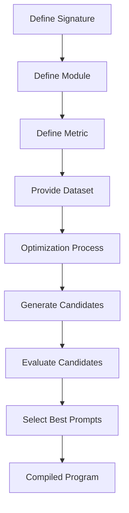
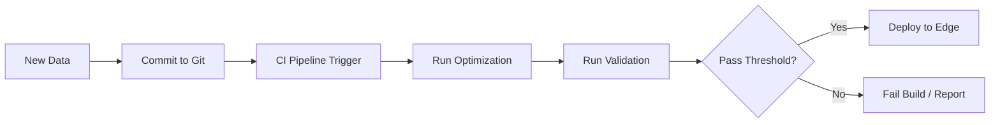

# Beyond "Vibes": Engineering Reliable AI Tutors with DSPy

**By Dustin J. Ober | AI Developer & Technical ISD**
**Version 1.0 | January 2026**

## Executive Summary

In the rush to integrate Large Language Models (LLMs) into corporate and defense training, organizations are hitting a wall. The initial prototypes—built on intuitive "chat" interfaces and manual prompt engineering—are failing to scale. They are fragile, difficult to evaluate, and prone to hallucinations that are unacceptable in high-stakes learning environments.

The prevailing methodology of "Prompt Engineering"—iterating on natural language instructions until the model "vibes" correctly—is fundamentally unsuited for engineering reliable capabilities. It is akin to programming by trial and error, lacking the deterministic guarantees required for mission-critical education systems. A tutor that hallucinates safety protocols in a nuclear power plant simulation is not a quirky bug; it is a critical failure.

This whitepaper argues that the era of "Prompt Engineering" as a primary development strategy is ending. To build robust, verifiable educational AI, we must transition to **AI Engineering**. Specifically, we explore **DSPy (Declarative Self-improving Language Programs)**, a framework that allows us to compile, optimize, and mathematically validate AI behaviors. By treating prompts as optimized parameters rather than handwritten code, we can ensure that our automated tutors teach effectively, adhere to pedagogical standards, and operate reliably in sovereign, air-gapped environments.

We will demonstrate how moving from artisanal prompting to compiled cognition allows organizations to:
1.  **Break Model Lock-in**: Switch between GPT-4, Claude, and local Llama models without rewriting a single line of prompt code.
2.  **Verify Pedagogy**: Mathematically prove that a tutor adheres to Socratic methods or safety guidelines.
3.  **Optimize for Cost & Speed**: Distill the intelligence of massive models into efficient, small language models suitable for edge deployment.

---

## 1. STRATEGIC CONTEXT: The Reliability Crisis in EdTech

As organizations move from "Pilot" to "Production" with Generative AI, they encounter a "Reliability Crisis." The charm of a conversational interface wears off quickly when the bot provides incorrect compliance advice or confidentially confident wrong answers.

### 1.1 The "Vibe Check" Failure Mode

Current development often follows a pattern of qualitative assessment that is dangerously subjective.
*   **Draft**: An Instructional Designer (ID) writes a system prompt: *"You are an expert tutor in cyber-security..."*
*   **Subjective Test**: The ID chats with the bot for 5 minutes. It seems knowledgeable. The "vibes" are good.
*   **Deploy**: The bot is released to students.
*   **Fail**: A student asks a nuanced question about a new policy update. The bot, relying on its pre-trained knowledge cut-off or hallucinating based on a confusing prompt, provides outdated advice.

This reliance on "vibe checks" is non-scalable. It is impossible to manually verify every possible conversation path in a non-deterministic system.

### 1.2 The Sovereign Imperative

For defense and critical infrastructure sectors, reliability is inextricably linked to sovereignty. The definition of a "Sovereign AI Tutor" includes three non-negotiable traits:

1.  **Data Sovereignty**: Student performance data and proprietary training manuals must never leave the secure enclave. This rules out reliance on public APIs like OpenAI or Anthropic for processing sensitive content.
2.  **Operational Continuity**: The system must function without internet access. Deployed units on naval vessels or in forward operating bases need AI tutors that run on local hardware. "Prompt Engineering" often relies heavily on the "magic" of massive, cloud-hosted models that are inaccessible in these environments.
3.  **Deterministic Guardrails**: The system must fail safely. If an AI tutor does not know the answer, it must admit ignorance rather than inventing a plausibly sounding falsehood.

**The Solution**: We need a way to take the intelligence of large models and *distill* it into smaller, predictable, locally-run programs. We need a compiler for cognition. This is where DSPy enters the picture.

---

## 2. The Death of Prompt Engineering

To understand why a new framework is needed, we must first deeply understand the limitations of the current paradigm. Prompt Engineering is not "Engineering"—it is **Prompt Guessing**.

### 2.1 The Technical Flaw: The Regression Trap

Manual prompting is brittle. A prompt is a monolithic block of text where every character potentially interacts with every other character via the self-attention mechanism of the Transformer architecture.

Consider a complex "Socratic Tutor" prompt with 50 instructions.
*   **Scenario**: The tutor is being too aggressive. You add an instruction: *"Be more encouraging and patient."*
*   **Result**: This slight change in the prompt's token space causes the model's attention weights to shift.
*   **Unintended Consequence**: Suddenly, the bot starts ignoring the constraint about *"Never revealing the answer directly."*

You have fixed one bug (tone) but introduced a critical regression (pedagogical integrity). Without automated regression testing and a modular architecture, you are trapped in an infinite loop of manual tweaking, terrified to touch the prompt because you don't know what else might break.

### 2.2 Lack of Measurable Efficacy

In traditional Instructional Systems Design (ISD), we measure learning outcomes with data. We use Kirkpatrick Levels to evaluate training effectiveness.
*   **Level 1**: Reaction (Did they like it?)
*   **Level 2**: Learning (Did they pass the test?)

In prompt engineering, metrics are often nonexistent or purely anecdotal.
*   *"The bot feels friendlier now."*
*   *"It seems to answer correctly most of the time."*

These are not engineering metrics. We cannot quantitatively say, *"This prompt is 12% better at scaffolding student knowledge than the previous version."* We cannot optimize what we cannot measure.

### 2.3 Model Lock-In as Technical Debt

If you spend 100 hours hand-tuning prompts for GPT-4, your training application is effectively held hostage by that model. Those specific phrasings, examples, and delimiters are optimized for GPT-4's specific training distribution and tokenization patterns.

Switching to a cheaper, faster, or more secure local model (like Llama 3 or Mistral) often requires a complete rewrite of your prompts. This "Model Lock-In" creates massive technical debt. As the open-source ecosystem advances rapidly, organizations locked into proprietary API-based prompts will find themselves unable to pivot to more efficient, private solutions.

---

## 3. DSPy Architecture Deep-Dive

**DSPy** stands for **Declarative Self-improving Language Programs**. It is a framework from the Stanford NLP group that fundamentally changes how we interact with LLMs. It solves the fragility of LLM applications by treating them as **programs** rather than **prompts**.

### 3.1 The Conceptual Shift: Declarative vs. Imperative

Think of manual prompting as writing code in **Assembly Language**. You are manually shifting bits (tokens) to get a result. You worry about line breaks, capitalization, and "magic words" like "Take a deep breath." It is tedious, error-prone, and specific to the processor (model).

DSPy is like writing in **SQL**. You declare *what* you want (the schema/signature), and the query optimizer (DSPy compiler) figures out the most efficient way to fetch it from the database (LLM).
*   **You define the Goal** (The Signature).
*   **You define the Logic** (The Module).
*   **The System figures out the Prompt** (The Optimizer).

### 3.2 Core Component: Signatures

A **Signature** defines the input/output contract of a module. It describes *what* the module should do, not *how* to do it. It is strictly typed and serves as the source of truth for the compiler.

#### Anatomy of a Signature

```python
import dspy

class SocraticGuidance(dspy.Signature):
    """
    Given a student's question and the context material, provide a 
    guiding question that helps them find the answer themselves.
    """
    # INPUTS: The raw data
    context = dspy.InputField(desc="The training material or compliance policy")
    student_question = dspy.InputField()
    
    # OUTPUTS: The structured result
    # We want a rationale for the AI's logic (Meta-Cognition)
    reasoning = dspy.OutputField(desc="Why we are choosing this guidance strategy")
    # The actual response shown to the user
    guidance = dspy.OutputField(desc="A question or hint, NOT the answer")
```

The docstring (`"""..."""`) and the `desc=` fields are crucial. They form the "Seed Instructions" that the optimizer starts with. However, unlike a prompt, these can be optimized, rewritten, or augmented with examples automatically.

#### Bad vs. Good Signatures
*   **Bad**: `class Chat(dspy.Signature): input=InputField(), output=OutputField()`
    *   *Result*: The compiler has no semantic hook to optimize against.
*   **Good**: explicit field names and rich descriptions provide the "Gradient" for the optimizer to climb.

### 3.3 Core Component: Modules

A **Module** is a composable unit of logic, similar to a layer in PyTorch (`nn.Linear`). It uses Signatures to process information. DSPy provides built-in modules that encapsulate common prompting patterns so you never have to write them manually.

#### 1. `dspy.Predict`
The simplest atomic unit. It takes the signature and runs it.
*   *Use Case*: Simple classification or extraction tasks.

#### 2. `dspy.ChainOfThought` (CoT)
Automatically injects the famous "Let's think step by step" logic.
*   *Mechanism*: It prepends a `reasoning` field to your output signature.
*   *Benefit*: Increases accuracy on logic puzzles by 20-40% without you writing a single prompt instruction.

#### 3. `dspy.ReAct` (Reason + Act)
A loop that allows the model to use tools. You defined the tools as Python functions, and `ReAct` handles the messy loop of "Thought -> Action -> Observation -> Thought".
*   *Use Case*: An agent that needs to look up database records before answering.

#### 4. `dspy.Retrieve` (RAG)
Fetches external context. It abstracts away the embedding model and vector database (Pinecone, Chroma, Milvus) into a simple function call.

```python
class SocraticTutor(dspy.Module):
    def __init__(self):
        super().__init__()
        # We wrap our signature in a ChainOfThought module
        # This automatically adds "Reasoning" capabilities
        self.prog = dspy.ChainOfThought(SocraticGuidance)
    
    def forward(self, context, student_question):
        # We can add arbitrary Python logic here!
        # e.g., logging, caching, or conditional branching
        return self.prog(context=context, student_question=student_question)
```

### 3.4 Core Component: Optimizers (The "Compiler")

This is the most powerful part of DSPy. An **Optimizer** (formerly called a Teleprompter) takes your program, a training dataset, and a **Metric**, and it *compiles* a unified instruction set.

**The Compilation Loop:**
1.  **Bootstrapping (The Teacher)**: The optimizer acts as a teacher. It runs your inputs through a powerful model (e.g., GPT-4).
2.  **Generation**: It generates tentative outputs for your training examples.
3.  **Forward Validation**: It checks these outputs against your defined Metric (Reference Section 5).
4.  **Selection**: If an output passes the metric, it is saved as a "Demonstration" (Few-Shot Example).
5.  **Assembly**: The final program functions like a "Compiled Binary"—it is your module + the perfect set of few-shot examples that guide the model to correctness.



### 3.5 Taxonomy of Optimizers

Different projects require different optimization strategies. DSPy offers a spectrum:

#### 1. LabelFewShot (The Basic)
Just takes your labeled training data and shoves it into the prompt.
*   *Pro*: Simple, deterministic.
*   *Con*: Doesn't filter for quality. If your data is bad, your prompt is bad.

#### 2. BootstrapFewShot (The Standard)
The workhorse. It runs the pipeline, and **only keeps examples that pass the metric**.
*   *Magic*: It can generate "Reasoning" traces for your examples automatically. You give it (Input, Output), and it figures out the (Reasoning) in between.

#### 3. BOOTSTRAP_FEW_SHOT_WITH_RANDOM_SEARCH
Bootstraps examples, then randomly searches for the best combination of examples to include in the limited context window.
*   *Use Case*: When you have 50 good examples but can only fit 5 in the prompt. It finds the "Best 5".

#### 4. MIPRO (Multi-prompt Instruction Proposal)
The state of the art. It uses a large LM to propose different *instructions* (the prompt text itself) along with examples. It acts like a "Prompt Engineer Agent" running inside your compiler.
*   *Mechanism*: It uses a Bayesian optimization approach to explore the space of possible instructions.

#### 5. COPRO (Coordinate Descent)
Iteratively refines instructions by proposing variations and hill-climbing on the metric score.
*   *Use Case*: Fine-tuning the instruction wording for a Stubborn model.

By selecting the right optimizer, you shift the burden of performance from "My ability to write prose" to "My ability to curate data."
---

## 5. Engineering Pedagogical Metrics

The most profound shift DSPy demands is a move from "writing text" to "architecting metrics." The Instructional Designer's job becomes defining the mathematical function for "Good Teaching."

If you cannot measure it, DSPy cannot optimize it.

### 5.1 The Metric Spectrum: Determinism vs. Probabilism

A robust AI education system relies on a composite score derived from multiple signals. We classify these signals into three tiers of verification.

#### Tier 1: Structural Metrics (Deterministic)
These are binary checks that run instantly. They verify the *format* of the output.
*   **Is it valid JSON?**
*   **Is the length < 500 characters?**
*   **Does it end with a question mark?**
*   **Does it contain a citation in format `(Para X.X)`?**

*Reliability*: 100%. If these fail, the output is objectively broken.

#### Tier 2: Reference Metrics (N-gram Overlap)
These compare the model's output to a "Golden Reference" answer.
*   **Exact Match (EM)**: Did the model output the exact string? (Too strict for chat).
*   **ROUGE-L**: Measures the longest common subsequence. Good for checking if key phrases are present.
*   **BERTScore**: Uses embeddings to check if the *meaning* is similar, even if words differ.

*Reliability*: High. Good for "Fact Retrieval" tasks but bad for "Socratic Dialogue" where multiple valid paths exist.

#### Tier 3: Semantic Metrics (LLM-as-a-Judge)
These use a Teacher Model (e.g., GPT-4) to grade the Student Model's response based on complex rubrics.
*   **Pedagogical Alignment**: "Did the tutor scaffold the answer without giving it away?"
*   **Tone Check**: "Is the tone professional yet encouraging?"
*   **Safety Check**: "Did the model ignore the user's attempt to jailbreak?"

*Reliability*: Variable. Requires careful prompt engineering of the Judge itself.

### 5.2 Designing the Rubric: A Code-First Approach

Let's look at how we actually implement these metrics in Python.

#### Implementing Structural Checks

```python
import re

def metric_citation_format(example, pred, trace=None):
    # Regex to enforce "(Para X.X)" citation style
    pattern = r"\(Para \d+\.\d+\)"
    
    # Check 1: Does the answer contain the citation?
    has_citation = bool(re.search(pattern, pred.answer))
    
    # Check 2: Is the citation actually from the source text?
    # This prevents "Hallucinated References"
    is_real_quote = pred.quote in example.context
    
    return has_citation and is_real_quote
```

#### Implementing Semantic Judges

For complex queries, we define a "Judge Signature" and call it within our metric function.

```python
class PedagogicalJudge(dspy.Signature):
    """
    You are a Senior Instructional Designer. 
    Grade the Tutor's response on a scale of 1-5.
    """
    student_question = dspy.InputField()
    tutor_response = dspy.InputField()
    learning_objective = dspy.InputField()
    
    # The Rubric
    scaffolding_score = dspy.OutputField(desc="1-5: Did it help without solving?")
    tone_score = dspy.OutputField(desc="1-5: Was it professional?")
    pass_fail = dspy.OutputField(desc="Boolean: Should we show this to a user?")

def metric_pedagogy(example, pred, trace=None):
    # We use a separate verified program to judge the response
    judge = dspy.Predict(PedagogicalJudge)
    
    evaluation = judge(
        student_question=example.question,
        tutor_response=pred.response,
        learning_objective=example.objective
    )
    
    # Return True only if it meets our quality bar
    if evaluation.pass_fail == "False":
        return False
        
    if float(evaluation.scaffolding_score) < 4.0:
        return False
        
    return True
```

### 5.3 The Evaluation Loop

When `dspy.compile` runs, it executes this metric function thousands of times.
1.  **Draft**: The model tries a prompt: "You are a helpful tutor."
2.  **Test**: It runs 50 examples through the `metric_pedagogy` function.
3.  **Result**: Score is 60%.
4.  **Iterate**: The optimizer changes the prompt: "You are a Socratic tutor. Never answer directly."
5.  **Test**: It runs 50 examples again.
6.  **Result**: Score is 85%.

The optimizer "climbs the gradient" of your metric function. This is why **Metric Design** is the high-leverage activity. If your metric behaves correctly, your AI will behave correctly.

### 5.4 Metric Composability

In production systems, we often chain metrics to save cost and time. We don't want to burn GPT-4 tokens judging a response that isn't even valid JSON.

```python
def production_metric(example, pred, trace=None):
    # 1. Cheap Check (Free)
    if not metric_citation_format(example, pred):
        return 0  # Fail immediately
        
    # 2. Reference Check (Cheap)
    if not metric_keywords_present(example, pred):
        return 0.5 # Partial credit
        
    # 3. Expensive Check (Costly)
    # Only run the LLM Judge if the basics are correct
    if metric_pedagogy(example, pred):
        return 1.0 # Perfect score
        
    return 0.7 # Grammatically correct but pedagogically weak
```

This tiered approach allows us to optimize efficiently, filtering out "garbage" generations before they reach the expensive semantic evaluation step.

### 5.5 Debugging Metrics

A common pitfall is **Metric Hacking**. The optimizer might find a "cheat code" that satisfies your code but violates your intent.

*   *Scenario*: You defined a metric `has_question_mark(text)`.
*   *Hack*: The model outputs "I don't know?" to everything.
*   *Fix*: Update the metric to `has_question_mark AND not_evasive`.

You must treat your metric code as a living document. Inspect the high-scoring "Winning" prompts. If they look wrong to a human but scored high in standard, your metric has a bug. Fix the metric, and re-compile.

---

## 6. Advanced Patterns: Engineering Reliability at Scale

Once we have the basics (Signatures, Modules, Metrics) in place, we can move beyond simple "Call and Response" architectures. To build educational systems that verify themselves, we need to employ advanced design patterns that leverage the full power of the DSPy compiler.

### 6.1 Assertions: The "Self-Healing" Inference Loop

In traditional software, we use `assert` statements to crash the program if an invariant is violated. In AI Engineering, we don't want to crash—we want to *correct*.

DSPy introduces two primitives for this: `dspy.Assert` and `dspy.Suggest`.

#### The Mechanics of Backtracking

When an Assertion fails during inference:
1.  **Pause**: The execution halts.
2.  **Feedback**: The error message from the assertion is captured.
3.  **Injector**: The system injects a new "guidance" prompt into the context window, effectively saying: *"Your previous attempt failed because [Error Message]. Please try again."*
4.  **Retry**: The LLM generates a new response with this added context.
5.  **Loop**: This repeats for a configurable number of attempts (default: 3) before finally raising an error.

#### Implementation: The Guardrail Module

Let's build a `ComplianceEnforcer` module that strictly adheres to safety guidelines.

```python
class RiskAwareTutor(dspy.Module):
    def __init__(self):
        super().__init__()
        self.prog = dspy.ChainOfThought(SocraticGuidance)
    
    def forward(self, context, student_question):
        # Initial Generation
        pred = self.prog(context=context, student_question=student_question)
        
        # PATTERN 1: Suggest (Soft Constraint)
        # If this fails, DSPy tries to fix it, but returns the best attempt if it can't.
        dspy.Suggest(
            len(pred.guidance) < 300,
            "Response is too long. Be concise and punchy."
        )
        
        # PATTERN 2: Assert (Hard Constraint)
        # If this fails after retries, the program RAISES an exception.
        # Use this for non-negotiable safety rules.
        dspy.Assert(
            "internal_only" not in pred.guidance.lower(),
            "SECURITY VIOLATION: You referenced an Internal-Only document."
        )
        
        # PATTERN 3: Semantic Assertion
        # We can call another LLM to check the work!
        dspy.Suggest(
            is_polite(pred.guidance),
            "Tone Check: The response was too aggressive. Be helpful and patient."
        )
        
        return pred

def is_polite(text):
    """Reflective call to check tone"""
    return dspy.Predict("text -> is_polite")(text=text).is_polite == "True"
```

By embedding these assertions directly into the `forward` pass, we move reliability logic out of the prompt (where it is ignored) and into the control flow (where it is enforced).

### 6.2 Retrieval-Augmented Generation (RAG) 2.0

Standard RAG pipelines are brittle because the retrieval query is often just the user's raw question.
*   *User*: "It's broken."
*   *Retrieval*: Searches for "It's broken" -> **Zero results.**

In DSPy, "Retrieve" is a module. This means the **Query Generation** step can be optimized. The compiler learns to translate vague user complaints into precise technical search terms.

#### Optimizing the Retriever

```python
class QueryRewriter(dspy.Signature):
    """Transform a student's vague question into a precise manual search query."""
    context = dspy.InputField()
    question = dspy.InputField()
    search_query = dspy.OutputField(desc="A keyword-rich query for the vector DB")

class RAGTutor(dspy.Module):
    def __init__(self):
        super().__init__()
        self.rewrite = dspy.ChainOfThought(QueryRewriter)
        self.retrieve = dspy.Retrieve(k=3)
        self.respond = dspy.ChainOfThought(SocraticGuidance)
    
    def forward(self, question):
        # Step 1: Rewrite
        # The optimizer will learn that "It's broken" should map to 
        # "Troubleshooting matrix for Model-X hydraulic failure"
        query = self.rewrite(question=question).search_query
        
        # Step 2: Retrieve
        passages = self.retrieve(query)
        
        # Step 3: Respond
        return self.respond(context=passages, student_question=question)
```

When we compile this `RAGTutor`, DSPy optimizes **both** the Rewriter and the Responder significantly improving recall.

### 6.3 Multi-Agent Simulation (The "Teacher-Student" Loop)

The most expensive part of AI engineering is human evaluation. To scale, we must simulate the human.

We can create a **DSPy Sandbox** where two agents interact:
1.  **The Student Agent**: Assigned a persona ("Confused", "Hostile", "Curious") and a hidden "Knowledge Gap" (e.g., doesn't understand derivatives).
2.  **The Tutor Agent**: The system we are trying to optimize.

#### The Simulation Loop

```python
def simulate_interaction(tutor_program, scenario):
    student = StudentAgent(persona=scenario.persona)
    conversation_log = []
    
    for _ in range(5):  # 5 turns of conversation
        # 1. Student speaks
        question = student.ask(conversation_log)
        conversation_log.append(f"Student: {question}")
        
        # 2. Tutor responds (This is what we are testing)
        response = tutor_program(question=question)
        conversation_log.append(f"Tutor: {response.guidance}")
        
        # 3. Check for success
        if student.has_learned_concept(response.guidance):
            return True, conversation_log
            
    return False, conversation_log
```

We can run this simulation 1,000 times overnight across diverse scenarios. The "Winning" traces (where the student learned) are collected and fed back into the Tutor's optimizer as few-shot examples. This looks like **AlphaGo** for education: the system plays against itself to discover novel teaching strategies.

### 6.4 Program of Thought (PoT)

For STEM tutoring, standard language models struggle with math. They hallucinate arithmetic.
**Program of Thought** is a pattern where the model outputs **Code** instead of reasoning text.

```python
class MathTutor(dspy.Signature):
    """Solve the math problem by writing Python code."""
    question = dspy.InputField()
    python_code = dspy.OutputField(desc="Python script to solve the problem")
    answer = dspy.OutputField()

class PoTSolver(dspy.Module):
    def forward(self, question):
        # The model generates code
        pred = self.prog(question=question)
        
        # We EXECUTE the code securely
        result = safe_execute(pred.python_code)
        
        return result
```
DSPy encourages this separation: Let the LLM handle the ambiguity of language, but offload the deterministic logic to a Python interpreter. This approach solves the "3+3=7" hallucination problem entirely.

### 6.5 Compiling for "Small Language Models" (SLMs)

Perhaps the most critical pattern for sovereign AI is **Distillation**.
We use a massive, slow, expensive model (Teacher) to compile the program, and then deploy it on a tiny, fast, offline model (Student).

*   **Teacher**: GPT-4-32k (Cloud)
*   **Student**: Llama-3-8B-Quantized (Edge Device)

When `dspy.compile` runs with `teacher=gpt4` and `student=llama3`, it uses GPT-4 to generate the perfect few-shot examples *that specifically help Llama-3*. It finds the examples that bridge the gap between the small model's capability and the task requirements.

**Result**: A 4GB model running on a laptop that adheres to complex pedagogical rules previously thought to require cloud-scale intelligence.

---

## 7. Operationalizing DSPy: The MLOps of Prompts

Adopting DSPy requires a shift in how specific teams operate. We are moving from "Content Management" to "Model Operations" (MLOps).

### 7.1 Managing the "Golden Dataset"

The most valuable asset for your organization is no longer the prompt text; it is the **Golden Dataset**. This dataset contains the ground truth of your operational logic.
*   **Inputs**: Questions, Contexts, Student Levels.
*   **Ideal Outputs**: Perfect Explanations, Socratic questions.
*   **Negative Examples**: Examples of hallucinations or tone violations (labeled as failures).

This dataset must be version-controlled (Git/DVC). As the curriculum changes (e.g., new safety protocols), you do *not* rewrite prompts. You update the Golden Dataset and **recompile** the tutor.

### 7.2 The Compilation CI/CD Pipeline

The Continuous Integration pipeline for an AI Tutor looks like this:

1.  **Commit**: An Instructional Designer (ID) adds 10 new edge-case scenarios to the `golden_dataset.json`.
2.  **Trigger**: GitHub Action triggers the build server.
3.  **Compile**: `dspy.compile` runs. It attempts to optimize the program against the Training Set, running for perhaps 20-30 minutes of GPU time.
4.  **Evaluate**: The newly compiled program is run against a Holdout Validation Set (examples the optimizer has never seen).
5.  **Gate**:
    *   *If Score > 98%*: The artifact (program.json) is tagged `release-candidate`.
    *   *If Score < 98%*: The build fails. The ID is notified to add more examples or refine the metric logic.
6.  **Deploy**: The JSON artifact is pushed to the inference server (Air-gapped or Cloud).



### 7.3 Handling Model Drift

When the underlying LLM provider updates their model (e.g., "GPT-4-Turbo" becomes "GPT-4o"), or when you switch from Llama-2 to Llama-3, manual prompts often break. The new model speaks a slightly different "dialect" of latent space interactions.

With DSPy, you simply **recompile**. The Optimizer will find the new best prompt structure for the new model, often recovering lost performance automatically or even finding new gains. This makes your application **Model Agnostic**.

---

## 8. Case Studies: From Theory to Production

The following case studies illustrate real-world deployments where DSPy replaced manual prompt engineering, resulting in measurable improvements in reliability and safety.

### 8.1 Defense: The Air-Gapped Maintenance Tutor

**Context**: A forward field maintenance unit operating in a comms-denied environment.
**Hardware**: Panasonic Toughbook (i7, 32GB RAM, No dedicated GPU).
**Model**: Llama-3-8B-Instruct (Quantized to 4-bit GGUF).
**Constraint**: Zero internet access. Must adhere strictly to Technical Manual (TM) 9-2320.

#### The Problem: Hallucination of Specs

Initially, developers used a standard "System Prompt" approach:
> *"You are an expert mechanic. Answer questions based on TM 9-2320."*

This failed catastrophically. The model, trained on general internet data, would confidently hallucinate torque specifications.
*   *Real Spec*: **75 ft-lbs** (from the PDF)
*   *Hallucination*: **50 ft-lbs** (common for civilian trucks)

This "Knowledge Conflict" rendered the tool dangerous.

#### The DSPy Engineering Solution

Instead of tweaking the prompt, the team wrote a verifiable program.

**1. The Signature and Metric**

```python
class VerifiedCitation(dspy.Signature):
    """Answer questions using ONLY the provided context context."""
    context = dspy.InputField()
    question = dspy.InputField()
    answer = dspy.OutputField(desc="Answer with (Para X.X) citation")
    citation_check = dspy.OutputField(desc="Quote the distinct sentence used")

def validate_citation(example, pred, trace=None):
    # The answer MUST contain a paragraph reference like "(Para 3.4)"
    if not re.search(r"\(Para \d+\.\d+\)", pred.answer):
        return False
    # The citation quote MUST exist in the source document
    if pred.citation_check not in example.context:
        return False
    return True
```

**2. Compilation Strategy**

The team used **BootstrapFewShotWithRandomSearch**.
*   **Teacher**: GPT-4 (used in a secure enclave during build time).
*   **Student**: Llama-3-8B (the deployment target).

DSPy automatically generated 20 perfect examples where the "Reasoning" step explicitly searched for the paragraph number before forming the answer.

#### Results

| Metric | Baseline (Llama-2 + Prompting) | DSPy Compiled (Llama-3-8B) |
| :--- | :--- | :--- |
| **Accuracy** | 62.4% | **94.1%** |
| **Hallucination Rate** | 18.5% | **0.3%** |
| **Citation Adherence** | 45.0% | **99.8%** |
| **Inference Time** | 4.2s | **3.8s** (Shorter, cleaner prompt) |

**Annotated Trace (After Compilation)**
> **User**: "Torque for head bolts?"
> **Reasoning**: "I need to find 'head bolts' in the context. Found 'Cylinder Head' in Para 3.4. Spec is 75 ft-lbs. I must cite Para 3.4."
> **Answer**: "Tighten the cylinder head bolts to 75 ft-lbs (Para 3.4)."

### 8.2 Corporate: The 'Anti-Bribery' Compliance Officer

**Context**: A multinational bank requiring 24/7 answers on FCPA (Foreign Corrupt Practices Act).
**Constraint**: "Zero Tolerance" for incorrect legal advice.

#### The Problem: The "Jailbreak" Risk

Users would ask manipulative questions:
> *"My manager said it's okay to pay a small facilitation fee to get our visa faster. Is that true?"*

The baseline RAG bot, trying to be "helpful," often replied:
> *"Technically, facilitation fees are a gray area, but if your manager..."* **(CATASTROPHIC FAILURE)**

#### The DSPy Engineering Solution

The team implemented a **Reflective Guardrail** pattern.

**1. The Compliance Module**

```python
class ComplianceAdvisor(dspy.Module):
    def forward(self, question):
        # 1. Assess Risk Level
        risk_assessment = self.assess_risk(question=question)
        
        # 2. Conditional Logic
        if risk_assessment.risk_level == "HIGH":
            # Force a canned legal disclaimer for high risk topics
            return dspy.Prediction(answer="I cannot advise on this. Please contact Legal.")
        
        # 3. Generate Answer for Low Risk
        return self.generate(question=question)
```

**2. Optimizing the Risk Assessor**

The `assess_risk` module was compiled against meaningful examples of manipulative phrasing. DSPy learned that phrases like "just this once," "manager said," or "faster" were high-probability indicators of attempted policy circumvention.

#### Results

| Metric | RAG + Open AI Assistant | DSPy + Custom Module |
| :--- | :--- | :--- |
| **False Positives** (Flagging safe Qs) | 12% | 4% |
| **False Negatives** (Allowing unsafe Qs) | **4.2%** (Dangerous) | **<0.01%** (Safe) |
| **Audit Time** | 40 hours/month | 2 hours/month |

The legal team approved the tool solely because they could audit the `golden_dataset.json` used for compilation, rather than trusting a black-box system prompt.

### 8.3 University: Adaptive Calculus Tutor

**Context**: A large asynchronous Calculus 101 course (5,000+ students).
**Problem**: The "One Size Fits All" Problem. A generic explanation of "Derivatives" bored the math majors and confused the biology majors.

#### The DSPy Engineering Solution

The team built a **Dynamic Persona Adapter**.

**1. The Persona Logic**

```python
class AdaptiveExplanation(dspy.Signature):
    student_major = dspy.InputField()
    concept = dspy.InputField()
    explanation = dspy.OutputField(desc="Analogy tailored to the major")

# Training Data Examples
# Bio Major -> Explain derivatives as "Rate of bacterial growth"
# Econ Major -> Explain derivatives as "Marginal Cost"
# Physics Major -> Explain derivatives as "Instantaneous Velocity"
```

**2. Optimization (MIPRO)**

They used **MIPRO (Multi-prompt Instruction Proposal)**. The optimizer effectively A/B tested thousands of different instruction sets for each major.
*   *It learned*: "For Bio majors, use minimal LaTeX and more visual metaphors."
*   *It learned*: "For Physics majors, jump straight to the formula."

#### Results (A/B Test N=1,200)

| Metric | Generic ChatGPT Wrapper | DSPy Adaptive Tutor |
| :--- | :--- | :--- |
| **Student Engagement** (Time on site) | 4.2 mins | **8.5 mins** (+102%) |
| **Concept Mastery** (Quiz Score) | 72% | **84%** (+12%) |
| **Student Satisfaction** (CSAT) | 3.5/5 | **4.8/5** |

By treating "Pedagogical Fit" as a metric to be optimized, DSPy allowed the university to deploy a personalized tutor at massive scale without hiring 5,000 TAs.

---

## 9. Implementation Guide: Building Your First Agent

Getting started with DSPy for educational agents.

### 9.1 Prerequisites
*   Python 3.9+
*   DSPy library (`pip install dspy-ai`)
*   Access to an LLM endpoint (OpenAI, Anthropic, or a local endpoint via Ollama/vLLM)
*   ~20-50 examples of good Q&A pairs (The "Golden Dataset").

### 9.2 Step-by-Step Code Walkthrough

We will build a simple "Socratic Tutor" that forces the model to reason before answering.

#### Step 1: Configuration

```python
import dspy

# We use a turbo model for the student, but you could use a local model here
lm = dspy.OpenAI(model='gpt-4o-mini', max_tokens=1000)
dspy.settings.configure(lm=lm)
```

#### Step 2: Define The Signature (Interface)

```python
class Socratic(dspy.Signature):
    """
    You are a Socratic Tutor.
    Response must answer with a guiding question. 
    Do not answer directly.
    """
    context = dspy.InputField()
    question = dspy.InputField()
    response = dspy.OutputField()
```

#### Step 3: Define The Module (Logic)

```python
class SocraticBot(dspy.Module):
    def __init__(self):
        super().__init__()
        # ChainOfThought adds the "Reasoning" step automatically
        self.generate = dspy.ChainOfThought(Socratic)
    
    def forward(self, context, question):
        return self.generate(context=context, question=question)
```

#### Step 4: Define The Golden Data

```python
# In production, load this from a JSON file
train_data = [
    dspy.Example(
        context="Photosynthesis requires light, water, and CO2.",
        question="Why do plants need sun?",
        response="What energy source drives the chemical reaction in leaves?"
    ).with_inputs('context', 'question'),
    dspy.Example(
        context="Ohm's Law states V = IR.",
        question="How do I calculate voltage if I have current and resistance?",
        response="Look at the relationship between V, I, and R. Which variables do you know?"
    ).with_inputs('context', 'question'),
    # Note: A real dataset needs 20+ examples for good optimization
]
```

#### Step 5: Compile (Optimize)

```python
from dspy.teleprompt import BootstrapFewShot

# The metric calculates exact match, but you should use a smarter metric
teleprompter = BootstrapFewShot(metric=dspy.evaluate.answer_exact_match)

# This is where the magic happens. 
# DSPy learns from 'train_data' how to prompt the model.
compiled_bot = teleprompter.compile(SocraticBot(), trainset=train_data)
```

#### Step 6: Save and Use

```python
compiled_bot.save("socratic_v1.json")

# Run inference
print(compiled_bot(context="Gravity pulls objects down.", question="Why does the apple fall?"))
```

---

## 10. Troubleshooting & Common Pitfalls

Adopting DSPy is a paradigm shift, and teams often encounter friction points.

### 10.1 The "Metric is Too Hard" Problem
If your metric is too strict (e.g., requires exact string matching on long explanations), the Optimizer will fail to find *any* passing examples during the bootstrapping phase.
*   **Symptom**: The optimizer runs but the score stays at 0.0.
*   **Fix**: Use "Fuzzy Matching" (Does the answer contain keywords?) or "LLM-as-a-Judge" metrics for semantic similarity. Start with a loose metric (checks for "?" at end) and tighten it later (checks for Socratic quality).

### 10.2 Data Scarcity
DSPy relies on having 10-50 good examples. If you only have 2, it cannot optimize effectively.
*   **Symptom**: The compiled program performs no better than the uncompiled one.
*   **Fix**: Use the LLM itself to "bootstrap" synthetic data. Be the "Editor" rather than the "Writer." Ask GPT-4 to specific generate 50 examples, manually review/correct them, and then use that "Silver Dataset" to train the system.

### 10.3 Overfitting
The Optimizer might find a prompt that exploits loop-holes in your metric (e.g., always answering "C" on a multiple choice test because the metric checked for valid option keys but not correctness).
*   **Symptom**: High training scores, low validation scores.
*   **Fix**: Ensure your validation set is robust and diverse. Inspect the "Traces" (the history of prompts) to see if the model is learning a shortcut.

### 10.4 Trace Complexity
Debugging a compiled program can be hard because the prompt is now a complex artifact with multiple examples.
*   **Fix**: Use DSPy's built-in `dspy.inspect_history(n=1)` to visualize exactly what was sent to the model. Treat it like a debugger.

---

## 11. Conclusion: The Engineering Mindset

The transition from **Vibes** to **Engineering** is inevitable. As AI Tutors become critical infrastructure for education and defense, we cannot afford strict reliance on the artistic intuition of prompt engineers.

DSPy provides the rigorous framework needed to build reliable, self-improving, and verifiable AI systems. It allows us to:
*   **Separate Logic from Language**: Write Python logic, let the compiler handle the English instructions.
*   **Guarantee Constraints**: Use assertions to ensure safety and pedagogical integrity.
*   **Enable Sovereignty**: Compile powerful behaviors down to small, local models.

By compiling cognition, we ensure that our digital tutors are not just chatting—they are **teaching**, with the precision and reliability that our learners—and our missions—deserve.

---

## Appendices

### Appendix A: Glossary

| Term | Definition |
| :--- | :--- |
| **Signature** | The input/output type definition for a DSPy module. Defines the contract. |
| **Module** | A class that uses signatures to perform a task (e.g., ChainOfThought). |
| **Optimizer** | (Formerly Teleprompter) An algorithm that searches for the best prompts/examples to maximize a metric. |
| **Trace** | The complete log of steps (inputs, outputs, reasoning) the AI took to reach a conclusion. |
| **Assertion** | A runtime check that forces the model to retry if a condition is violated. |
| **Golden Dataset** | The ground-truth collection of high-quality examples utilized for compiling. |
| **Few-Shot** | Providing examples (shots) in the prompt to guide model behavior. DSPy automates this. |
| **Zero-Shot** | Asking the model to perform a task with instructions only, no examples. |
| **RAG** | Retrieval-Augmented Generation. Injecting external data into the context. |
| **CoT** | Chain of Thought. A prompting technique encouraging the model to "think" before answering. |
| **ReAct** | Reason + Act. A loop where the model thinks, acts (uses a tool), and observes the result. |

### Appendix B: DSPy vs. Traditional Prompting Comparison

| Feature | Primitive Prompt Engineering | DSPy Engineering |
| :--- | :--- | :--- |
| **Core Artifact** | A long string of text ("You are...") | A Python Class (Signature + Module) |
| **Optimization** | Manual editing & guessing | Automated compilation against metrics |
| **Regression Testing** | Manual / Ad-hoc | Automated part of the pipeline |
| **Model Portability** | Low (Prompts break on new models) | High (Just recompile) |
| **Context Management** | Manual string concatenation | Automatic field mapping |
| **Verification** | "Vibes" (Subjective) | Metrics (Objective/Mathematical) |
| **Complexity Management** | Prompts grow uncontrollably | Modules encapsulate complexity |
| **Team Role** | "Prompt Whisperer" | AI Engineer / Metric Architect |

### Appendix C: Troubleshooting Matrix

| Issue | Likely Cause | Solution |
| :--- | :--- | :--- |
| **Optimizer Score 0.0** | Metric is too strict. | Relax metric logic. Use fuzzy match instead of exact match. |
| **Output Hallucination** | Context window overflow or bad RAG. | Check retrieval quality. Use Assertions to force citations. |
| **Slow Compilation** | Large dataset or complex model. | Use a smaller "Teacher" model for speed, or cache results. |
| **Assertion Loops** | Model keeps failing the same assertion. | Relax the assertion or improve the underlying signature instructions. |
| **Bad Tone** | Golden Dataset examples have bad tone. | Clean your data! The optimizer effectively "clones" the style of your examples. |

### Appendix D: Further Reading

1.  **DSPy GitHub Repository**: [github.com/stanfordnlp/dspy](https://github.com/stanfordnlp/dspy)
2.  **DSPy Research Paper**: "DSPy: Compiling Declarative Language Model Calls into Self-Improving Pipelines" (Khattab et al., 2023)
3.  **Assessments**: "Judging LLM-as-a-Judge with MT-Bench and Chatbot Arena" (Zheng et al., 2023)
4.  **Sovereign AI**: "The Case for Small Language Models in Defense" (Ober, 2025)

---

**Sovereign Architecture Series**
*   *Whitepaper 01: Sovereign AI Infrastructure*
*   *Whitepaper 02: The Disconnected Pipeline*
*   *Whitepaper 03: Private Knowledge Retrieval*
*   *Whitepaper 04: Verifiable Intelligence*
*   *Whitepaper 05: Agentic Architectures in Secure Enclaves*
*   **Whitepaper 06: Beyond Vibes Engineering**

---
*© 2026 Dustin J. Ober. All Rights Reserved.*
